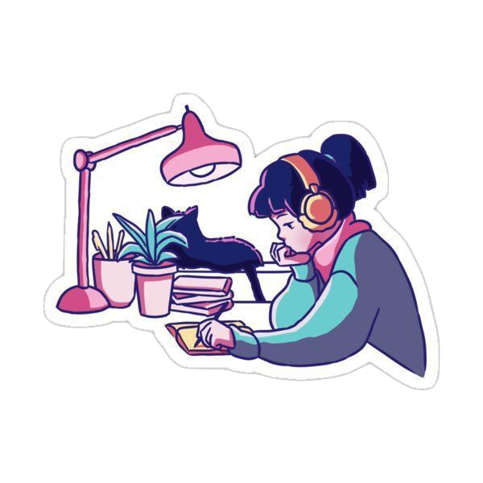

## Hello World! 🌎

I'm Fatima, a Jr. Front-End developer, always with one eye open, and the other dreaming 🚀✨

 

<ul>
<li> 🌱 Hi! I'm constantly 📖 reading, 🧠 learning and 👩🏻‍💻 coding </li>
<li> 🔭 I'm currently learnign JavaScript and React.js </li>
<li> 💼 My web portfolio: <a href="https://porfolio-website-gules.vercel.app">www.fatimagallardo.com</a> </li>
<li> 📫 How to reach me: <a href="https://github.com/FatimaGR">fawicoma@gmail.com</a> </li>
<li> ⚡ Fun-Fact: I like cats 🐾, draw 🎨 and read webcomics ♥️ </li>
</ul>

 

### Skills
#### Technical Skills & Tools

#### Soft Skills
- Creativity
- Patience
- Respect and teamwork
- Empathy
- Self-development
